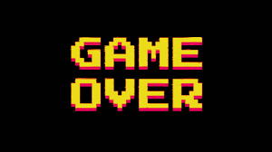

# ***Snake Game*** 

## **Introduction** 

+ Họ và tên: Tạ Duy Khánh  - K68J - UET

+ Mã sinh viên: 23020677 

+ Bài tập lớn: Snake Game /INT2215_52 - Lập trình nâng cao 

## **Description**

### *Game description and instruction*  

- Game có đầy đủ các chức năng hỗ trợ người chơi trong việc điều chỉnh dễ dàng giữa các chế độ, thoát game, mô tả cách chơi ... 

- Video demo: https://youtu.be/pOB-ZGEsfTg

### *Control* 

| Control |  Cách 1  |  Cách 2  |
|---------|----------|----------|
| UP      |     ↑    |     w    |
| DOWN    |     ↓    |     s    |
| LEFT    |     ←    |     a    |
| RIGHT   |     →    |     d    | 

### *Preview* 

## **Setup** 
- *Cách 1*: 
    1. Truy cập đường dẫn https://github.com/khanhtaduy2k5/BTL_gameSDL2/releases/tag/published  để tải file rar về máy
    (Cách này tiết kiệm bộ nhớ và thời gian tải đi rất nhiều (khoảng 100MB).)
    2. Giải nén file vừa tải vào một thư mục và bật SNAKE.exe để chơi game

- *Cách 2*: 
    - Yêu cầu: Có C++ compiler và tải Code::Blocks 

    1. Clone repo: Dùng terminal hoặc git bash tải source code về máy: git clone https://github.com/khanhtaduy2k5/BTL-gameSDL2.git 
    
    Hoặc chọn Code -> Download Zip

    2. Vào thư mục vừa tải về và ấn đúp vào project SNAKE 

    3. Trên thanh công cụ bấm vào Build and run và bắt đầu chơi game.  

### *Các kỹ thuật sử dụng*

- Thư viện SDL2.0

- Sử dụng nhiều class, vector, tách file, nạp chồng toán tử, ...

- Tạo các đối tượng: rắn, táo, đuôi, ... 

- Tạo menu 

- Đọc và xử lí âm thanh

### *Nguồn tham khảo* 

- Phát triển dựa trên mã nguồn: https://github.com/csuet/AdvProg_AY2324/tree/master/AdvProg_L7-Snake

- Cách sử dụng thư viện SDL2.0, quản lý chương trình: -Tham khảo trên lazyfoo 

- Hình ảnh: Tra trên Google 

- Âm thanh: Lấy trên pixabay.com

## **Conclusion** 

### ***Điều tâm đắc***

- Em thấy mình đã cải thiện được rất nhiều kỹ năng trong việc viết code, khả năng lên ý tưởng.

- Học được cách setup môi trường, sử dụng thư viện ngoài. 

- Rắn trong game được sử dụng danh sách liên kết đơn đã học trong chương trình 

### ***Hướng phát triển***
- Tạo AI Snake để đấu với người chơi 

- Rắn có thể đâm vào tường và đi ra ở hướng đối diện

- Cập nhật thêm Highest Score và Restart Game. 
